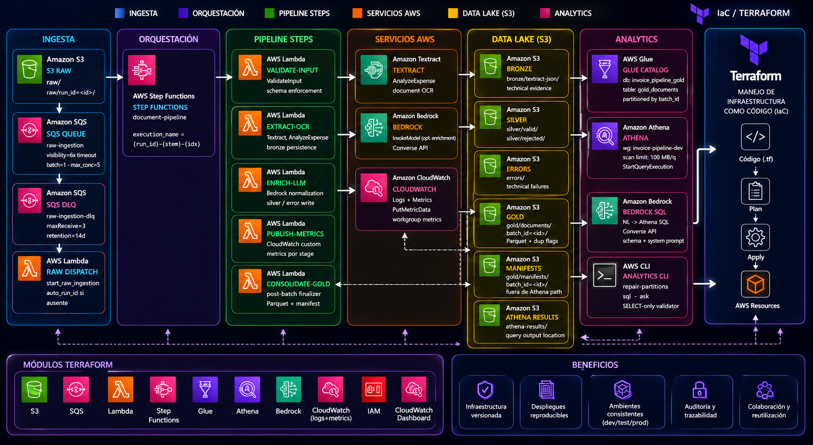

# Invoice Intelligence Pipeline

## Overview

Invoice Intelligence Pipeline is a cloud-first AWS data engineering project for
invoice ingestion, OCR extraction, quality-aware routing, and analytics-ready
Gold data products.

The MVP has been validated in AWS with Terraform-managed infrastructure,
event-driven processing, traceable `run_id` execution, layered S3 outputs,
CloudWatch observability, and an Athena/Glue analytics path with optional
Bedrock-assisted natural-language SQL.

## Business Problem

Invoice operations often start with semi-structured files and end with manual
review, inconsistent fields, and limited traceability. This project turns raw
invoice files into inspectable data lake outputs with explicit accepted,
rejected, and failed outcomes.

The goal is a simple, reproducible cloud pipeline that demonstrates the business
idea without hiding infrastructure or runtime behavior behind a framework.

## Solution Architecture

The AWS MVP uses a decoupled event flow:

1. A document is uploaded to `s3://<data-lake-bucket>/raw/<file>` or
   `s3://<data-lake-bucket>/raw/run_id=<run_id>/<file>`.
2. S3 sends the upload event to the raw ingestion SQS queue.
3. The `raw-dispatch` Lambda consumes the SQS message, creates a `run_id` when
   needed, and starts Step Functions.
4. Step Functions runs `ValidateInput -> ExtractOCR -> EnrichWithLLM -> PublishRunMetrics`.
5. The pipeline writes bronze evidence, silver outcomes, technical errors, and
   CloudWatch metrics.
6. Gold consolidation publishes analytics-ready Parquet snapshots for Glue,
   Athena, and optional Bedrock natural-language querying.

## Key Features

- Terraform-managed AWS dev environment under `infra/envs/dev`.
- S3 data lake prefixes for raw, bronze, silver, gold, errors, and metrics.
- SQS buffering with DLQ routing for raw uploads.
- Step Functions orchestration with separated validation, OCR, enrichment, and
  metrics stages.
- Lambda handlers for dispatch, validation, Textract extraction, Bedrock
  enrichment, and run metrics.
- Gold analytics layer with Glue Data Catalog, Athena workgroup, scan limits,
  and SELECT-only SQL validation.
- Canonical contracts, quality rules, metrics, and prompts under `specs/`.
- Explicit packaging and Terraform workflows for reproducible deployment.

## Extension Features

- Remote Terraform state backend in S3 with stage-level locking for safer team
  collaboration and environment isolation.
- Pluggable LLM model selection so the enrichment and natural-language SQL
  stages can use different Bedrock or compatible LLM models as business needs
  evolve.
- Glue job replacement path for Lambda processing stages when document volume,
  runtime, or batch size exceeds Lambda processing limits.
- Data warehouse consolidation path for publishing curated Gold data into
  Redshift, Snowflake, or another warehouse according to business reporting and
  governance requirements.

## Architecture Diagram



The maintainable Graphviz source is
[`docs/resources/architecture.dot`](docs/resources/architecture.dot).

```text
S3 raw/ or raw/run_id=<run_id>/
        |
        v
SQS raw-ingestion ----> SQS DLQ
        |
        v
Lambda raw-dispatch
        |
        v
Step Functions document-pipeline
        |
        v
ValidateInput
        |
        v
ExtractOCR ----> Textract AnalyzeExpense
        |                  |
        |                  v
        |        S3 bronze/textract-json/
        v
EnrichWithLLM ----> Bedrock optional normalization
        |
        v
S3 silver/valid/ | silver/rejected/ | errors/
        |
        v
PublishRunMetrics ----> CloudWatch Logs + Metrics
        |
        v
consolidate-gold ----> S3 gold/documents/batch_id=<batch_id>/
                   \-> S3 gold/manifests/batch_id=<batch_id>/
                                    |
                                    v
                       Glue Catalog (invoice_pipeline_gold.gold_documents)
                                    |
                                    v
                       Athena workgroup <----- src/analytics CLI
                                    ^                |
                                    |                v
                                    +------- Bedrock NL -> SQL
```

## Repository Structure

```text
ai/                 Agent guidance, skills, and context configuration
artifacts/lambda/   Generated Lambda deployment bundle
docs/               Architecture notes, runbooks, deployment history, and diagrams
infra/envs/dev/     Executable Terraform entrypoint for the AWS MVP
infra/modules/      Focused reusable Terraform modules
scripts/quality/    Ruff lint and format wrappers
scripts/windows/    Windows setup and Makefile wrapper helpers
specs/              Contracts, quality rules, metrics, prompts, and design specs
src/                Python pipeline, Lambda handlers, Glue jobs, and analytics code
```

The older `infra/` root stack is kept as a transition baseline. New AWS MVP
work should use `infra/envs/dev`.

## Data Lake Layers

- `raw/`: source documents uploaded directly or under `run_id=<run_id>`.
- `bronze/textract-json/`: Textract technical evidence and extraction metadata.
- `silver/valid/`: canonical accepted documents.
- `silver/rejected/`: canonical documents rejected by quality or business rules.
- `errors/`: technical processing failures and failed silver documents.
- `gold/documents/batch_id=<batch_id>/`: curated Parquet snapshots for Athena.
- `gold/manifests/batch_id=<batch_id>/`: batch manifests kept outside the table
  prefix.

## Gold Analytics Layer

The Gold layer is provisioned in
[`infra/envs/dev/analytics.tf`](infra/envs/dev/analytics.tf) and includes:

- a Glue database `invoice_pipeline_gold`,
- an external table `gold_documents` partitioned by `batch_id`,
- an Athena workgroup `invoice-pipeline-dev` with per-query scan limits,
- a Python analytics CLI under [`src/analytics/`](src/analytics/).

Example usage after deployment:

```powershell
$lake = terraform -chdir=infra/envs/dev output -raw data_lake_bucket_name
$env:ATHENA_OUTPUT_LOCATION = "s3://$lake/athena-results/"
$env:BEDROCK_MODEL_ID = "anthropic.claude-3-haiku-20240307-v1:0"

python -m src.analytics.cli repair-partitions
python -m src.analytics.cli sql "SELECT vendor_name, COUNT(document_id) AS docs FROM gold_documents GROUP BY vendor_name"
python -m src.analytics.cli ask "How many accepted invoices per vendor in the latest batch?"
```

Generated SQL is validated by
[`src/analytics/sql_validator.py`](src/analytics/sql_validator.py). It accepts
only single `SELECT` statements, rejects unsafe operations, limits references to
known schema objects, and enforces a bounded `LIMIT`.

## Specs And Design Records

Specs and decision records live in [`specs/`](specs/). Key references include:

- [`SPEC-004-runtime-iam-validation.md`](specs/SPEC-004-runtime-iam-validation.md)
- [`SPEC-005-structured-logging.md`](specs/SPEC-005-structured-logging.md)
- [`SPEC-006-ocr-llm-separation.md`](specs/SPEC-006-ocr-llm-separation.md)
- [`SPEC-007-terraform-remote-state.md`](specs/SPEC-007-terraform-remote-state.md)
- [`SPEC-008-analythic-layer.md`](specs/SPEC-008-analythic-layer.md)
- [`specs/contracts/`](specs/contracts/) for canonical document schemas
- [`specs/quality/`](specs/quality/) for bronze, silver, and gold rules
- [`specs/metrics/pipeline_metrics.yaml`](specs/metrics/pipeline_metrics.yaml)
  for metrics expectations

## Development And Packaging

This repository uses Python 3.11+ and `uv`.

```powershell
make init
make lint
make fmt
make package
```

On restricted Windows environments, use the wrapper flow documented under
[`docs/windows_setup/`](docs/windows_setup/), for example:

```powershell
.\scripts\windows\run_make.ps1 package
```

The Lambda bundle is generated at
`artifacts/lambda/control_plane_bundle.zip`. Lambda-only dependencies are listed
in [`requirements.lambda.txt`](requirements.lambda.txt).

## Terraform Deployment

The active dev stack is under [`infra/envs/dev`](infra/envs/dev/README.md).
Typical planning commands are:

```powershell
.\.venv\Scripts\python.exe scripts\package.py --package-manager uv
terraform -chdir=infra/envs/dev init -backend=false
terraform -chdir=infra/envs/dev validate
terraform -chdir=infra/envs/dev plan -var-file=terraform.tfvars.example
```

For a real deployment, create the artifact bucket first, upload
`artifacts/lambda/control_plane_bundle.zip` to the configured artifact key, then
plan and apply the stack. Do not run `terraform apply` without explicit approval
and a reviewed plan.

Remote state is prepared through `backend.tf.example`; copy it to `backend.tf`
only when the backend bucket and state policy are intentionally configured.

## Operational Validation

After deployment, trigger the pipeline by uploading a supported document to the
raw prefix:

```powershell
$lake = terraform -chdir=infra/envs/dev output -raw data_lake_bucket_name
aws s3 cp .\data\raw\0000089370.tif s3://$lake/raw/run_id=run-001/0000089370.tif
```

Use CloudWatch Logs, Step Functions execution history, S3 output prefixes, Glue
partitions, and Athena queries to inspect results end to end.

## Current Status

The cloud MVP has validated the business idea and the operational path:

- S3 raw upload trigger.
- SQS to Lambda dispatch.
- Step Functions execution.
- Textract-backed OCR stage.
- Bedrock-ready enrichment boundary.
- Bronze, Silver, Gold, and error routing.
- `run_id` traceability.
- CloudWatch logging and metrics.
- Glue/Athena analytics over Gold outputs.

## Roadmap

- Polish public documentation and diagrams.
- Publish representative architecture and execution evidence.
- Harden alarms, retries, selective reprocessing, and cost monitoring.
- Promote environment-specific settings for future non-dev deployments.
- Keep Terraform plans small, explicit, and reviewable.

## License

This project is licensed under the MIT License. See [`LICENSE`](LICENSE).
