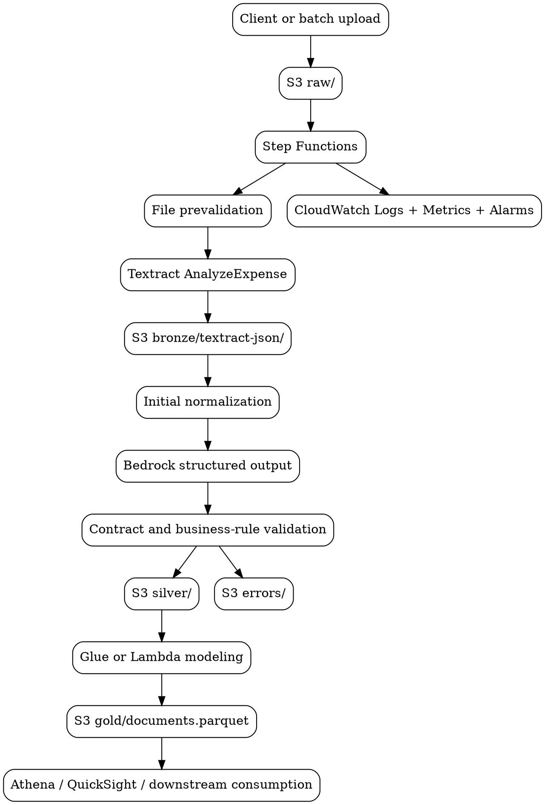

# AWS Implementation Proposal

## Objective

This document describes how to evolve the current local MVP into a more stable, observable, and scalable AWS implementation by leveraging managed services such as Amazon Textract and Amazon Bedrock.

The goal is not to move the MVP "as is" to the cloud, but to redesign the critical parts that explain today's main findings:

- highly variable latency in the LLM phase
- empty or failed responses from the local model
- too many `unknown` classifications
- missing dates, amounts, and vendor values
- lack of validation and run-level traceability

## Design Principles

The target AWS implementation should follow these principles:

1. separate OCR, structured extraction, validation, and final modeling
2. use specialized services before asking the LLM to do everything
3. maintain traceability by run, by document, and by phase
4. allow per-document retries without reprocessing the full batch
5. provide clear observability for quality, cost, and latency

## Target Architecture Summary

The main recommendation is to use:

- `Amazon S3` for layered storage
- `AWS Step Functions` for orchestration
- `Amazon Textract AnalyzeExpense` for OCR and invoice field extraction
- `Amazon Bedrock` for normalization, classification, and ambiguity resolution
- `AWS Lambda` or `AWS Glue` for lightweight transformations and consolidation
- `CloudWatch` for logs, metrics, and alarms
- optionally `SQS` and `SNS` for asynchronous control and decoupling

## Proposed Diagram

## Mapping the Current MVP to AWS

### Raw Phase

Current local state:

- files in `data/raw`

AWS proposal:

- `S3` bucket with a `raw/` prefix
- per-run convention, for example:
  - `s3://bucket/raw/run_id=<id>/...`

Benefits:

- durable storage
- batch ingestion
- ability to reprocess historical runs

### Bronze Phase

Current local state:

- local Tesseract
- OCR Markdown in `data/bronze`

AWS proposal:

- replace free-form OCR with `Amazon Textract AnalyzeExpense`
- store the original Textract response as the technical bronze layer

Suggested bronze output:

- `bronze/textract-json/...`
- `bronze/ocr-text/...` if you still want to preserve a derived plain-text form

Why Textract:

- it is specialized in invoices and receipts
- it provides a standard taxonomy for fields such as vendor, date, invoice ID, and totals
- it reduces the semantic burden currently pushed onto the LLM

### Silver Phase

Current local state:

- minimal prompt to Ollama
- local JSON parsing
- postprocessing with internal rules

AWS proposal:

- use `Amazon Bedrock` only where it truly adds value
- feed the model with Textract structured output, not with full free-form OCR
- require `structured outputs`
- add validation rules before accepting a row

Suggested Bedrock responsibilities:

- classify `document_type`
- resolve the final vendor when there are multiple candidates
- normalize ambiguous dates
- normalize amounts when fields conflict
- fill secondary fields not covered by Textract

Responsibilities that should not depend only on the LLM:

- base OCR
- primary detection of totals and invoice date
- basic vendor identification on invoices

### Gold Phase

Current local state:

- local DataFrame
- single `documents.parquet` output

AWS proposal:

- consolidate valid silver output into `documents.parquet` on `S3`
- execute modeling with `AWS Glue`, `Lambda`, or `ECS` depending on volume
- partition by run date or document type if volume grows

Suggested gold output:

- `s3://bucket/gold/documents/run_date=YYYY-MM-DD/...`

## Recommended Execution Flow

### Option 1: Simple batch for a cloud MVP

A good option for the first AWS version.

1. upload documents to `S3 raw/`
2. launch a `Step Functions` execution
3. iterate document by document
4. call `Textract AnalyzeExpense`
5. store bronze output
6. invoke `Bedrock` for structured normalization
7. validate contract and business rules
8. write to `silver/` or `errors/`
9. consolidate to parquet in `gold/`
10. publish run metrics

### Option 2: Asynchronous batch for higher volume

Better if volume grows significantly.

1. upload the batch to `S3`
2. enqueue references in `SQS`
3. workers process documents in parallel
4. `Step Functions` or `EventBridge` coordinate final consolidation

## Recommended AWS Components

### Amazon Textract

Use it for:

- document OCR
- vendor extraction
- invoice date extraction
- total amount extraction
- line-item extraction if needed later

Expected outcome:

- meaningful quality improvement over free-form OCR + minimal prompt

### Amazon Bedrock

Use it for:

- document classification
- controlled normalization
- explanation or resolution of ambiguities
- JSON output with a fixed schema

Expected outcome:

- fewer parsing errors
- fewer format-related retries
- lower dependence on fragile prompts

### Step Functions

Use it for:

- orchestrating phases
- controlling retries
- separating recoverable errors from permanent failures
- recording state by run

### CloudWatch

Use it for:

- logs by phase
- metrics by run
- alarms for error rate, latency, and quality

## Recommended Quality Controls

The migration to AWS should include explicit validations that are currently missing or insufficient.

### Per-document quality rules

- reject unjustified future dates
- reject absurd years such as `0703`
- flag amounts outside the expected range
- require at least one of `vendor`, `date`, or `total_amount` to accept a document
- record quality flags per row

### Per-run metrics

- documents received
- documents processed
- documents failed
- total run time
- p50, p95, and max latency by phase
- vendor completion rate
- date completion rate
- amount completion rate
- `unknown_document_type` rate
- estimated cost per 1000 documents

## Data Strategy and Traceability

Each document should carry technical metadata such as:

- `run_id`
- `document_id`
- `source_s3_key`
- `ingestion_timestamp`
- `ocr_engine`
- `llm_model_id`
- `quality_flags`
- `processing_status`

This will enable:

- auditing
- selective retries
- comparison across model versions
- offline quality evaluation

## Implementation Roadmap

### Phase 1: Controlled cloud MVP

Objective:

- move the pipeline to AWS without losing simplicity

Suggested scope:

- `S3`
- `Step Functions`
- `Textract`
- `Bedrock`
- `Lambda`
- `CloudWatch`

Deliverables:

- complete batch run over a controlled sample
- gold parquet in S3
- simple metrics dashboard

### Phase 2: Quality hardening

Objective:

- address the findings from the local MVP

Suggested scope:

- validation rules
- document quality score
- exception queue
- comparison between Textract output and Bedrock output

### Phase 3: Operational scaling

Objective:

- prepare the flow for larger batches

Suggested scope:

- asynchronous processing
- controlled parallelism
- gold partitioning
- cost and throughput monitoring

## Risks and Mitigations

### Risk 1: assuming Bedrock replaces everything

Mitigation:

- use Bedrock for reasoning and normalization tasks
- use Textract for core document extraction

### Risk 2: increasing cost without improving real quality

Mitigation:

- measure quality against a labeled set
- compare local vs AWS pipelines on the same subset

### Risk 3: keeping silent errors in gold

Mitigation:

- block rows with impossible values
- separate `silver_valid` and `silver_rejected`
- add rejection metrics by rule

## Final Recommendation

The best AWS evolution for this project is not to "replace Ollama with Bedrock" directly. The best evolution is:

1. `Textract` for OCR and primary document extraction
2. `Bedrock` for normalization and classification with structured output
3. `Step Functions` for orchestration and retries
4. `CloudWatch` for observability
5. `S3` as a layered data lake across `raw`, `bronze`, `silver`, and `gold`

That design directly addresses the main findings from the local MVP:

- reduces dependence on free-form OCR
- reduces fragile LLM parsing
- improves JSON consistency
- makes scaling and traceability easier
- provides a much more realistic production foundation
