# Local MVP: Implementation, Ollama Tests, and Findings

## Objective

This document summarizes how the local invoice pipeline MVP is currently implemented, which Ollama-related tests and evidence were reviewed, and which main findings were identified from the stress run observed in the project.

The main evidence used for this summary comes from:

- `run_pipeline.py`
- `src/pipeline/bronze_pipeline.py`
- `src/pipeline/silver_pipeline.py`
- `src/pipeline/gold_model.py`
- `src/services/ocr_service.py`
- `src/services/llm_service.py`
- `tests/test_olama.py`
- `logs/pipeline.log`
- `logs/gold.log`
- `data/gold/documents.parquet`

## Executive Summary

The local MVP works as a sequential three-phase pipeline:

1. `raw -> bronze`: local OCR with Tesseract over images.
2. `bronze -> silver`: minimal extraction with Ollama using `qwen3.5:4b`.
3. `silver -> gold`: normalization and consolidation into `documents.parquet`.

The last large run recorded on `2026-05-02` completed the end-to-end flow with `330` processed documents and `330` rows written to `data/gold/documents.parquet`. However, the results show three clear limitations of the MVP:

- high latency variability in the LLM phase
- incomplete coverage of key fields
- inconsistent semantic quality in dates, amounts, and document classification

## Current Local MVP Architecture

```dot
digraph MVP_Local {
    rankdir=LR;
    node [shape=box, style=rounded];

    raw [label="data/raw\n*.tif *.png *.jpg"];
    bronze_pipeline [label="Bronze pipeline"];
    ocr [label="Local Tesseract OCR"];
    bronze_output [label="data/bronze/*.md"];
    silver_pipeline [label="Silver pipeline"];
    prompt [label="Minimal prompt"];
    ollama [label="Ollama local\nqwen3.5:4b"];
    parse [label="Parse JSON + retries"];
    postprocess [label="Postprocess + contract mapping"];
    silver_output [label="data/silver/*.json"];
    silver_errors [label="data/errors/silver/*.json"];
    gold_pipeline [label="Gold pipeline"];
    normalize [label="Date and amount normalization"];
    classify [label="Document classification"];
    gold_output [label="data/gold/documents.parquet"];
    logs [label="logs/*.log"];

    raw -> bronze_pipeline;
    bronze_pipeline -> ocr;
    ocr -> bronze_output;
    bronze_output -> silver_pipeline;
    silver_pipeline -> prompt;
    prompt -> ollama;
    ollama -> parse;
    parse -> postprocess;
    postprocess -> silver_output;
    parse -> silver_errors;
    silver_output -> gold_pipeline;
    gold_pipeline -> normalize;
    normalize -> classify;
    classify -> gold_output;

    bronze_pipeline -> logs;
    silver_pipeline -> logs;
    gold_pipeline -> logs;
}
```

## How It Is Implemented

### Orchestration

`run_pipeline.py` executes the three phases in order and records global metrics:

- `Starting RAW to BRONZE OCR phase`
- `Starting BRONZE to SILVER LLM extraction phase`
- `Starting SILVER to GOLD relational phase`
- `PIPELINE_METRICS`

There is no real parallelism in the current execution. The default configuration in `src/config/pipeline.yaml` sets `concurrency: 1`.

### Bronze

The bronze phase:

- reads files from `data/raw`
- supports `.png`, `.jpg`, `.jpeg`, `.tif`, `.tiff`
- uses `pytesseract` + `PIL`
- generates one Markdown file per document in `data/bronze`
- moves files to `data/errors` if OCR fails

The bronze output contains:

- source file name
- source file path
- OCR text embedded in a `text` block

### Silver

The silver phase:

- reads each `*.md` from `data/bronze`
- builds a minimal prompt
- calls local Ollama at `http://localhost:11434/api/generate`
- uses `format` with a minimal JSON schema
- retries when blocking flags appear
- writes `data/silver/*.json` when extraction is usable
- writes `data/errors/silver/*.json` when extraction remains blocked

The current prompt targets only:

- `total_amount`
- `document_date`
- `vendor_name`

After the LLM call, the pipeline performs mapping and postprocessing to complete the local contract with fields such as:

- `document_id`
- `source_file`
- `document_type`
- `vendor_or_requester`
- `amount`
- `total_amount`
- `currency`
- `raw_text_path`

### Gold

The gold phase:

- loads all JSON files from `data/silver`
- normalizes amounts and dates
- infers currency when possible
- classifies document type
- records quality flags
- writes `data/gold/documents.parquet`

The current gold layer is centered on a single primary output:

- `data/gold/documents.parquet`

## Ollama Tests Performed

### 1. Manual exploratory test

The file `tests/test_olama.py` shows an exploratory OCR + Ollama test over a sample file in `data/raw/ti31379007_9013.tif`.

Characteristics of this test:

- uses local Ollama
- expects pure JSON as output
- validates the availability of the configured model
- acts as a manual smoke test, not a robust benchmark

### 2. Unit and internal contract tests

`tests/test_document_pipeline.py` covers important parts of the flow:

- root pipeline execution order
- bronze writing behavior
- LLM JSON parsing
- Ollama default behavior
- silver writing behavior
- error handling in silver
- parquet generation in gold
- silver and gold metrics

These tests validate code behavior, but they do not represent a real document-quality test over a large batch.

### 3. Observed stress-run evidence

The strongest evidence of real-load behavior reviewed in this analysis comes from:

- `logs/pipeline.log`
- `logs/gold.log`
- `data/gold/documents.parquet`

Important: `logs/pipeline.log` mixes several runs from `2026-05-02`, including failed runs and one final successful run. The final run relevant to this analysis starts at `2026-05-02 20:58:23` and ends at `2026-05-02 21:53:18`.

## Results Observed in the Successful Run

### Main metrics

According to `logs/pipeline.log`, the final run reports:

- `SILVER_METRICS total=330 succeeded=330 failed=0 success_rate=1.00`
- `elapsed_seconds=3199.34` in silver
- `avg_doc_seconds=9.69`
- `min_doc_seconds=3.38`
- `max_doc_seconds=1088.12`
- `docs_per_minute=6.19`
- `GOLD_METRICS rows=330`
- `PIPELINE_METRICS elapsed_seconds=3295.13`

This indicates that:

- the full pipeline completed
- no documents were lost between raw, bronze, silver, and gold in the final run
- the dominant bottleneck was the LLM phase

### Final observed volume

The current project evidence shows:

- `330` source files in `data/raw`
- `330` Markdown files in `data/bronze`
- `330` JSON files in `data/silver`
- `330` rows in `data/gold/documents.parquet`
- `0` files in `data/errors` for the final reviewed state

## Main Findings

### 1. The local MVP demonstrated viability, not production robustness

The successful final run shows that the local flow can complete OCR, extraction, and consolidation over a relatively large batch. That validates the MVP as a proof of concept.

However, output quality and operational variability are still too inconsistent to consider it ready for demanding production workloads.

### 2. LLM latency is the main operational problem

Although the average per document was `9.69s`, there was a pronounced long tail:

- `5` documents above `10s`
- `3` documents above `30s`
- `2` documents above `60s`

The worst observed cases were:

- `0001136627.json`: `1088.12s`
- `00920607.json`: `713.44s`
- `00920638.json`: `37.22s`

This shows that the local Ollama-based system did not have stable latency under load. Even though the run completed, the variability is too high.

### 3. Structured parquet quality is moderate

The following results were observed in `data/gold/documents.parquet`:

- `330` rows
- `145` rows missing `document_date`
- `116` rows missing `vendor_or_requester`
- `121` rows missing `total_amount`
- `106` rows missing `currency`

The completion rates recorded by gold were:

- `amount_completion_rate=0.63`
- `date_completion_rate=0.56`
- `vendor_completion_rate=0.65`

For an invoice pipeline, these rates are useful for exploration, but still too low for business automation.

### 4. Document classification frequently falls back to `unknown`

Observed distribution:

- `unknown`: `244`
- `invoice`: `85`
- `contribution`: `1`

This suggests that the current minimal extraction does not provide enough semantic signal for strong downstream classification, or that the gold heuristic remains too limited.

### 5. There are clear anomalies in dates and amounts

Concrete examples of suspicious values were detected in the final parquet:

- future dates such as `2075-05-02`, `2074-09-29`, and `2070-12-31`
- an implausibly old date such as `0703-04-02`
- an extreme amount of `1084432400.0` for `0013267193.md`

This indicates that the pipeline not only has missing values, but also interpretation errors that require stronger business validations.

### 6. The root log shows prior instability with Ollama

Although the final run was successful, the same `logs/pipeline.log` contains evidence of earlier failed runs during `2026-05-02`:

- `95` `Ollama request failed` events
- `43` `empty_llm_response` events
- `21` writes into `data/errors/silver`

There are also failures caused by:

- `404 Client Error` against `http://localhost:11434/api/generate`
- `Read timed out`

This reinforces that the local Ollama stack was useful for iteration, but fragile under real sustained execution scenarios.

## Conclusions

The local MVP fulfills its technical validation role well:

- it proves the end-to-end flow
- it produces a real parquet output
- it leaves observable metrics
- it enables fast local iteration

However, the findings show that its main limitation is not only in OCR or only in the prompt. The real issue is the combination of:

- free-form OCR over heterogeneous documents
- minimal extraction with a local LLM
- lack of strong guardrails for dates, amounts, and classification
- local operation with variable latency and availability

## Immediate Recommendations

Before moving this MVP to production, it would be useful to:

1. strengthen business validations in silver or gold
2. isolate metrics by run so historical logs are not mixed
3. capture run IDs and per-batch artifacts
4. evaluate replacing free-form extraction with a combination of specialized OCR and managed structured output

The next document proposes that evolution toward AWS.
