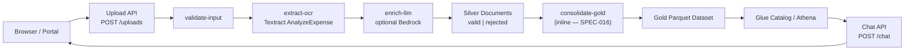
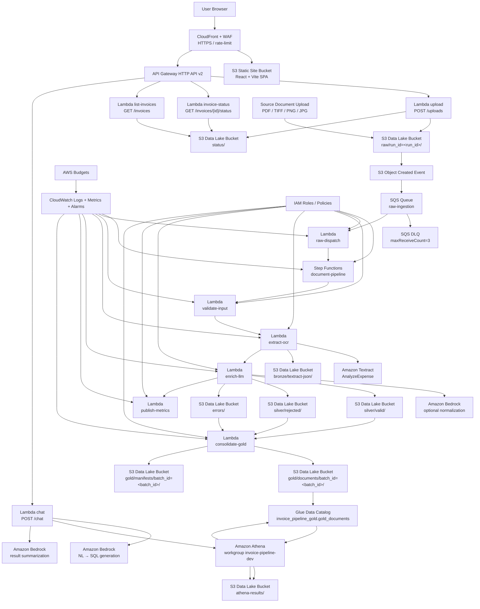
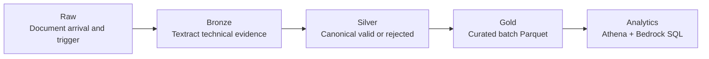
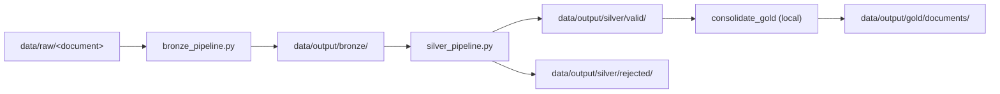
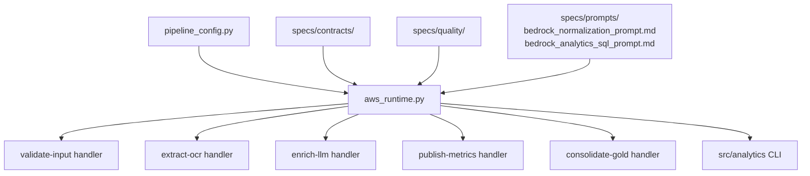

# Invoice Pipeline Architecture Diagram

## Objective

This document shows the current invoice pipeline architecture diagram, both as a functional flow and as the surrounding AWS services that support it.

## 1. General Pipeline Flow

## 2. Current AWS Architecture

## 3. Layer Detail

- `Raw`: entry point for the document and pipeline trigger.
- `Bronze`: Textract `AnalyzeExpense` JSON evidence and extraction metadata.
- `Silver`: canonical document records, split into accepted and rejected.
- `Gold`: per-batch Parquet snapshot with duplicate markers and business keys.
- `Analytics`: Glue-cataloged Athena queries, optionally generated from natural language by Bedrock.

## 4. Local Execution Diagram

## 5. Assets and Logic Diagram

This reflects the separation of responsibilities in the project:

- `Python`: Lambda handlers, runtime, validation, materialization
- `YAML`: contracts, quality rules, and metric definitions under `specs/`
- `Prompts`: Bedrock system prompts for normalization and analytics SQL
- `Terraform`: AWS infrastructure under `infra/envs/dev`
- `ASL`: Step Functions state machine definition

## 6. Summary

The invoice pipeline architecture combines:

- a clear `medallion` flow (Raw → Bronze → Silver → Gold) extended with `errors/` and inline Gold consolidation (SPEC-016)
- a serverless web portal (React + Vite on S3 + CloudFront + WAF) as the user-facing entry point
- HTTP API layer (API Gateway v2 + Lambda) for upload, status, history, and conversational analytics
- analytical consumption with `Glue Catalog + Athena + Bedrock NL → SQL + NL result summarization`
- security and observability with `IAM + CloudWatch Alarms + AWS Budgets + WAF rate-limiting`

The diagram represents the current deployed architecture across Phases 0–5. The MVP is complete: open portal → upload PDF → pipeline runs → NL query → NL answer is validated end to end on AWS.
